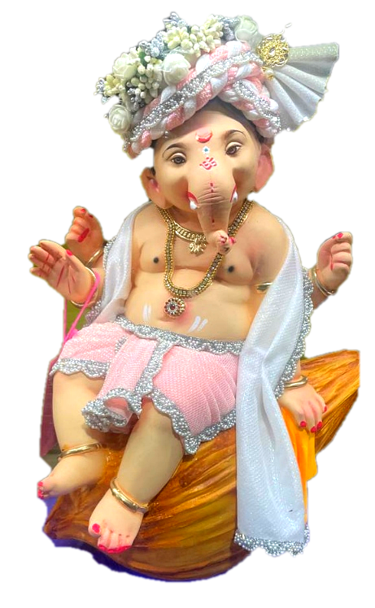

# 🪔 Shree Ganesh Utsav Invitation Website

An aesthetic, responsive, trilingual (Marathi, Hindi, English) web invitation crafted with devotion for **Ganesh Chaturthi Utsav celebrations**.



---

## ✨ Features

- 🌸 **Aesthetic Royal Design**: Deep Crimson and Marigold Gold festive palette with glowing mandalas, glassmorphism cards, and floating festive marigold petals.
- 🪔 **Authentic Idol Integration**: Centerpiece Ganpati Bappa with radiant golden *prabhavali* halo.
- 👧👦 **Kids' Corner / Host Integration**: Featuring authentic cutout visuals of **Shreeja & Shreejay Pawar**.
- 🎶 **Instant Background Devotional Audio**: Continuous seamless looping of **Ekadantaya Vakratundaya (Slowed & Reverb)** with auto-start playback and a floating mini player.
- 🗺️ **Accurate Interactive Leaflet Map**: Precise location pin at **Karan Apartment, Sector 16, Roadpali, Kalamboli, Navi Mumbai** (Near D-Mart) with 1-click Google Maps turn-by-turn directions.
- 🌐 **Trilingual Translation Switcher**: Instant language toggling between **मराठी (Marathi)**, **हिंदी (Hindi)**, and **English**.
- 💫 **Framer Motion Transitions**: Smooth physics-based spring animations, staggered reveals, and scroll-triggered transitions.
- 📱 **Mobile & Desktop Responsive**: Tailored layout that looks great on all screens.

---

## 🚀 Getting Started

### 1. Clone the repository
```bash
git clone https://github.com/NihalMishra3009/Ganpati-webiste.git
cd Ganpati-webiste
```

### 2. Run locally
You can open `index.html` directly in your browser or run any local HTTP server:

Using Python:
```bash
python -m http.server 3000
```
Then visit: `http://localhost:3000`

---

## 📁 Project Structure

```text
├── assets/
│   ├── ganpati_idol.png    # Authentic Ganpati Idol Cutout
│   └── kids_photo.png      # Shreeja & Shreejay Cutout
├── audio/
│   └── ekadantaya_vakratundaya_slowed_reverb.mp3 # Background Audio
├── index.html              # Main HTML5 Structure & Meta Tags
├── style.css               # Festive Styling & Responsive Layout
├── script.js               # Translations, Audio, Leaflet Map & Framer Motion
└── README.md               # Project Documentation
```

---

## 🕉️॥ गणपती बाप्पा मोरया, मंगलमूर्ती मोरया ॥
Crafted with devotion for Ganeshotsav Celebrations.
